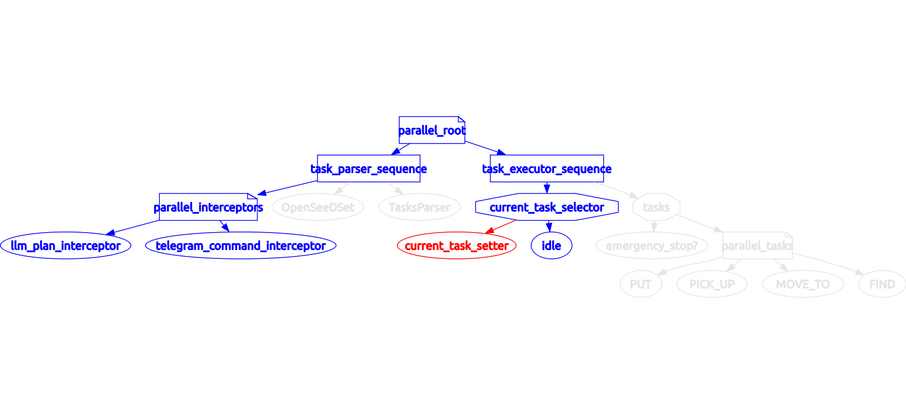

Behaviour tree (ros noetic) для команд PUT, PICK_UP, STOP, MOVE_TO, FIND, RECOGNIZE.



### Особенности

- Минимальный sleep дерева между обновлениями дерева для Хаски - 0.5 секунд.

### Пример запуска

Дерево запускается с помощью ```python3 main.py```
Отправить запрос в дерево можно с помощью скриптов в папке ```src/behaviour_tree/scripts/tests/```

### Установка

Пример для ros-noetic (смотри таблицу версий https://github.com/splintered-reality/py_trees_ros)

Клонируем репозитории только для чистой (новой) установки
1) git clone -b release/0.3.x https://github.com/splintered-reality/py_trees_msgs/ to a project workspace (src folder)
2) git clone https://github.com/ros-geographic-info/unique_identifier to a project workspace (src folder)
3) git clone -b behaviour_tree_example https://git.sberrobots.ru/mipt.navigation/interaction/communication_msgs to a project workspace (src folder)
4) clone move_base_msgs from https://github.com/ros-planning/navigation_msgs to a project workspace (src folder)
