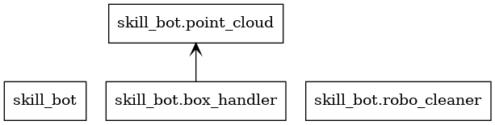
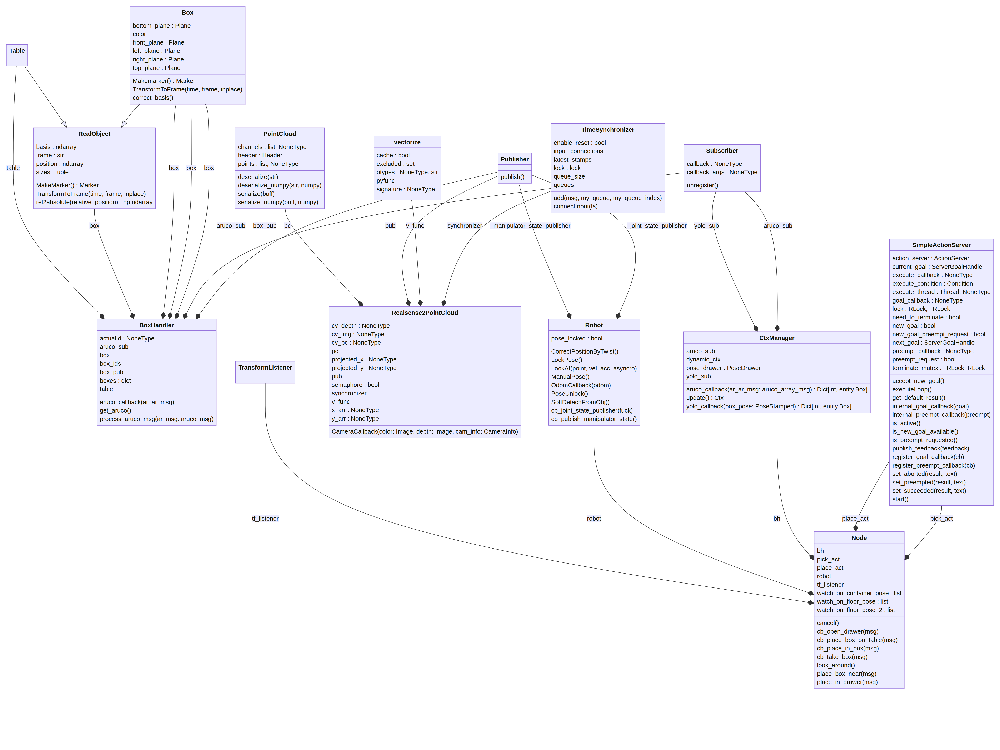

# object_manipulation_v2

| **Topic type** | **Topic name**                       | **Type**                                                      | **Description**                                                                                                      |
|----------------|--------------------------------------|---------------------------------------------------------------|----------------------------------------------------------------------------------------------------------------------|
| input          | `/aruco_localizator_v2/objects`      | `aruco_localization_v2/aruco_array_msg`                       | Распознанные аруко-маркеры                                                                                           |
| input          | `/object_pose`                       | `geometry_msgs/PoseStamped`                                   | Позиция задетекченного кубика нодой Криштопика                                                                       |
| input          | `/tracked_objects_3d`                | `vis_msgs/MarkersArray`                                       | Топик 3д трекера Криштопика                                                                                          |
| input          | `/pick_up_object/goal`               |                                                               | Топик экшен сервера для запуска команды схватить объект, можно опубликовать задание через `rostopic pub...`          |
| input          | `/pick_up_object/cancel`             |                                                               | Топик экшен сервера для отмены действия                                                                              |
| input          | `/put_object/goal`                   |                                                               | Топик экшен сервера для запуска складывания объекта в контейнер, можно опубликовать задание через  `rostopic pub...` |
| input          | `/put_object/cancel`                 |                                                               | Топик экшен сервера для отмены действия                                                                              |
| input          | `/tf`                                | `tf2_msgs/TFMessage`                                          | Трансформы используется трансформ `local_map_lidar->ur_arm_base`                                                     |
| input          | `/tf_static`                         | `tf2_msgs/TFMessage`                                          | Трансформы используется трансформ `local_map_lidar->ur_arm_base`                                                     |
| input          | `/command_robotiq_action/feedback`   | `robotiq_2f_gripper_msgs/CommandRobotiqGripperActionFeedback` | Топик экшен клиента для управления гриппером                                                                         |
| input          | `/command_robotiq_action/result`     | `robotiq_2f_gripper_msgs/CommandRobotiqGripperActionResult`   | Топик экшен клиента для управления гриппером                                                                         |
| input          | `/command_robotiq_action/status`     | `actionlib_msgs/GoalStatusArray`                              | Топик экшен клиента для управления гриппером                                                                         |
|                |                                      |                                                               |                                                                                                                      |
| output         | `/arm/1/joint_states`                | `sensor_msgs/JointState`                                      | По требованию сбер-роботикс публикуются состояния джоинтов в реальном времени                                        |
| output         | `/command_robotiq_action/cancel`     | `actionlib_msgs/GoalID`                                       | Управление гриппером                                                                                                 |
| output         | `/command_robotiq_action/goal`       | `robotiq_2f_gripper_msgs/CommandRobotiqGripperActionGoal`     | Управление гриппером                                                                                                 |
| output         | `/husky_velocity_controller/cmd_vel` | `geometry_msgs/Twist`                                         | Чтобы иногда нагло двигать всю базу без всяких планировщиков и контроллеров                                          |
| output         | `/manipulator/grasp_view`            | `sensor_msgs/Image`                                           | Публикация картинки с камеры с наложенной 3д моделью гриппера, чтобы визуализировать точку схвата                    |
| output         | `/pick_up_object/feedback`           | `communication_msgs/PickupObjectActionFeedback`               | Фидбэк экшен сервера взятия объекта                                                                                  |
| output         | `/pick_up_object/result`             | `communication_msgs/PickupObjectActionResult`                 | Результат экшен сервера взятия объекта                                                                               |
| output         | `/pick_up_object/status`             | `actionlib_msgs/GoalStatusArray`                              | Статус экшен сервера взятия объекта                                                                                  |
| output         | `/put_object/feedback`               | `communication_msgs/PutObjectActionFeedback`                  | Фидбэк экшен сервера складывания объекта                                                                             |
| output         | `/put_object/result`                 | `communication_msgs/PutObjectActionResult`                    | Результат экшен сервера складывания объекта                                                                          |
| output         | `/put_object/status`                 | `actionlib_msgs/GoalStatusArray`                              | Статус экшен сервера складывания оъекта                                                                              |
| output         | `/rosout`                            | `rosgraph_msgs/Log`                                           | Стандартный топик с логами                                                                                           |
| output         | `/state/arm/0/arm_state`             | `objects_manipulation_v2/ManipulatorState`                    | По требованию сбер роботикс публикуется состояние манипулятора                                                       |
| output         | `/tf`                                | `tf2_msgs/TFMessage`                                          | Публикуется трансформация `ur_arm_base->ur_gripper`                                                                  |

